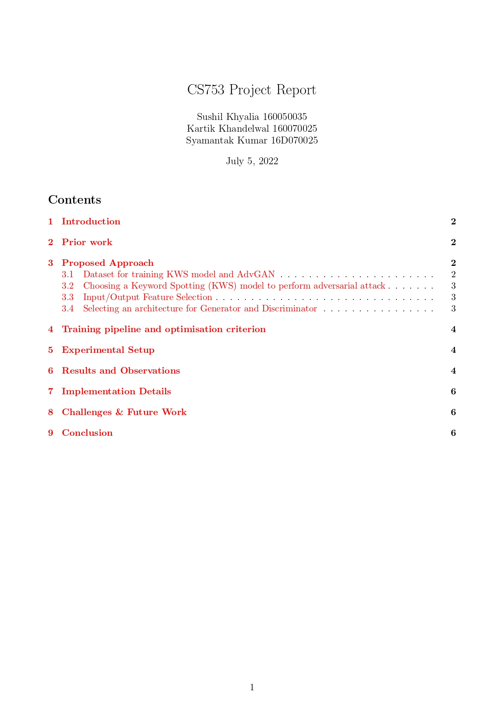
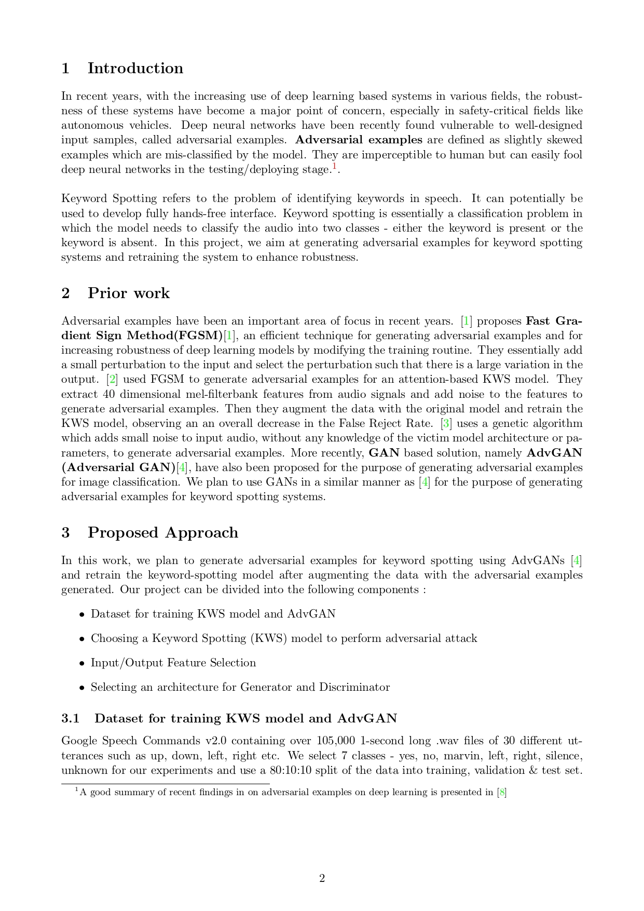
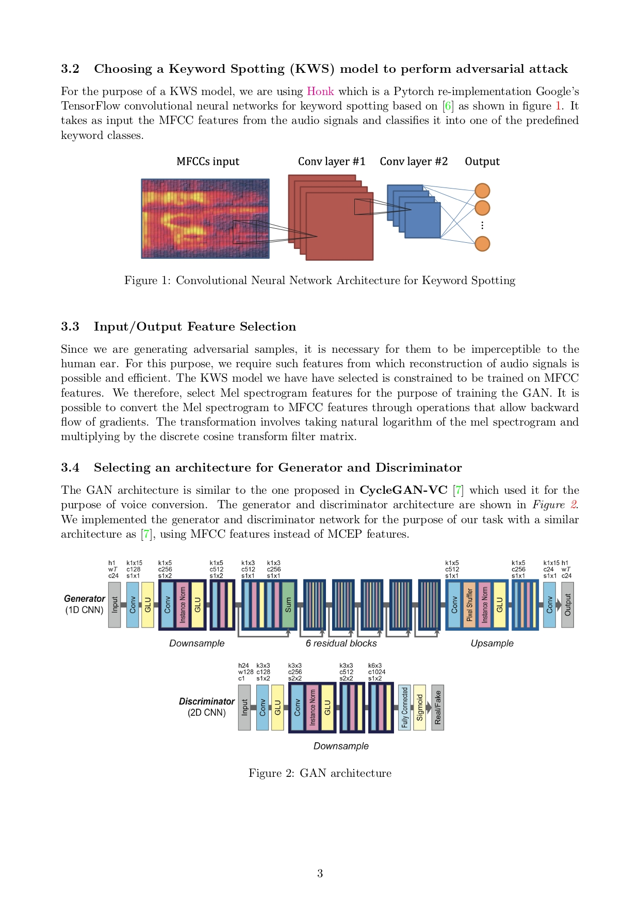
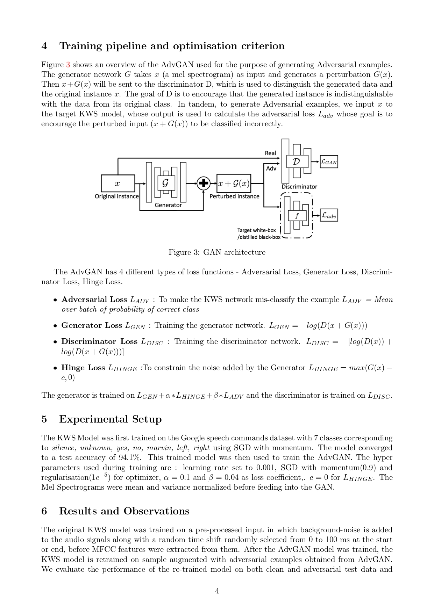
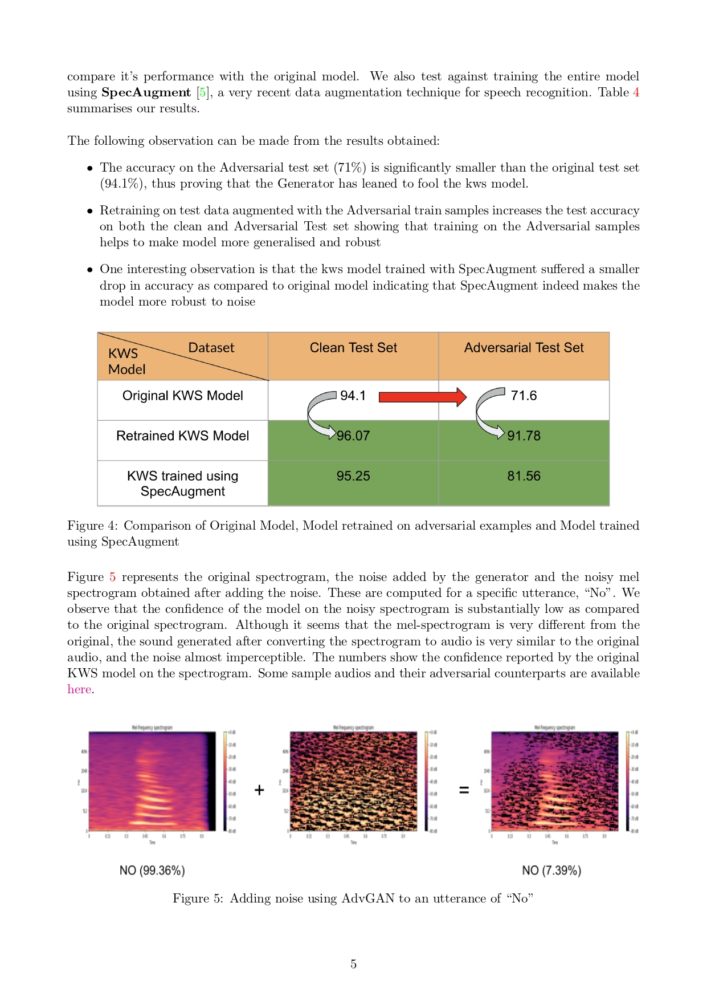
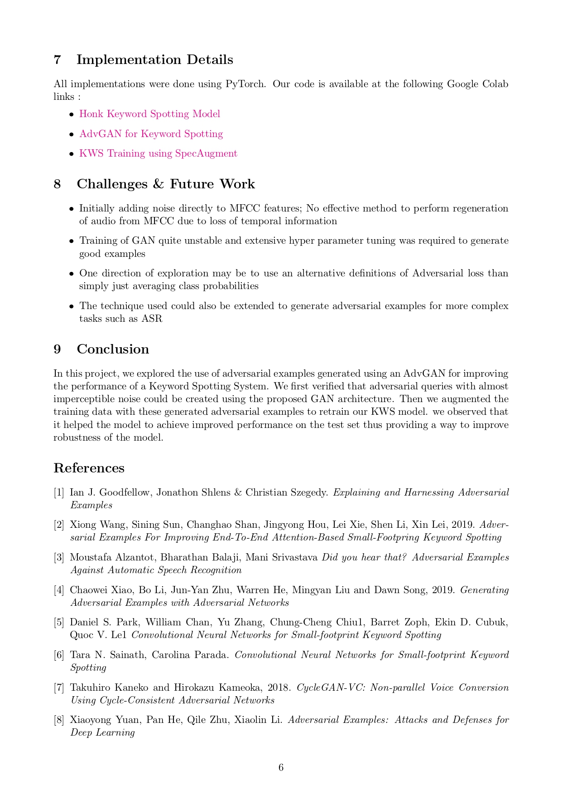

# AdvGAN-KWS
Generating Adversarial Examples for KWS systems using GANs. Course Project for CS753 Automatic Speech Recognition

We use a GAN to generate adversarial examples for a Keyword Recognition model. On the adverserial data, while having imperceptible changes to a human, the performance of the Keyword Recognition model decreases from **94%** to **71%**. Additionally, the model trained with Adversarial examples saw a relative improvement of **2%**   

